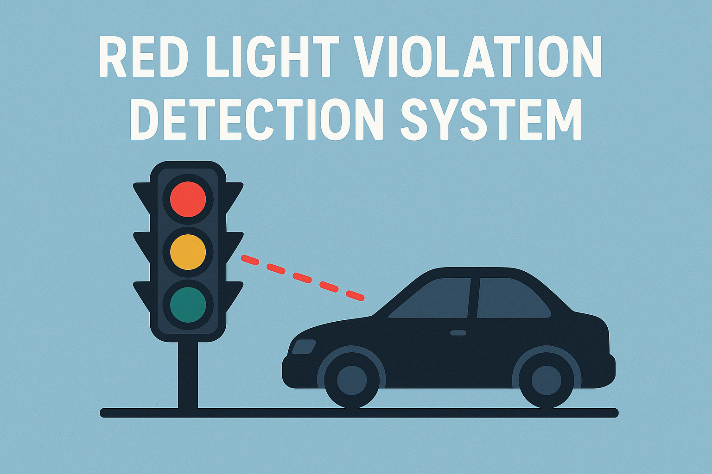
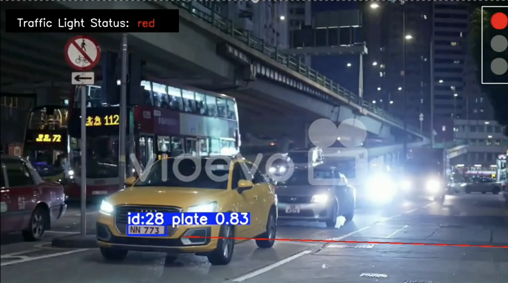
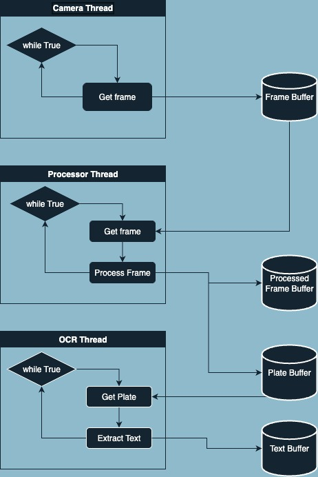

# 🚦Red Light Violation Detection System



## 💫Overview

To ensure compliance with traffic regulations, obeying traffic lights is essential.

Current techniques for detecting violations rely on sensors installed under the asphalt or LiDAR devices connected to cameras that capture images of the vehicle in case of an infraction.

The development of techniques based solely on Computer Vision + AI reduces the installation and maintenance costs of sensors.

My project (inspired by [this project](https://github.com/FarzadNekouee/Traffic-Violation-Detection) ) proposes a multithreading approach for the automatic detection of red-light violations.

---

## 📹Video Test
You can see the video result on youtube

<a href="https://www.youtube.com/watch?v=Yu2bcm_PKbM">
  
</a>

---

## 🗿Requirements

- Python: 3.12.10
- Required libraries:
  - opencv-python == 4.12.0.88
  - numpy == 2.0.2
  - ultralytics == 8.3.182
  - lap == 0.5.12
  - easyocr == 1.7.2
  - pandas 

---

## 💻Project description

The project is composed of several threads that write/read from different buffers:

1. **First thread**  
   - Reads the video frames  
   - Writes them into the **frame buffer**  

2. **Second thread**  
   - Reads (in batch) from the **frame buffer**  
   - Performs the following processing steps:  
     1. Traffic light color detection  
     2. Stop line detection  
     3. License plate detection (in frame batches)  
   - Writes into the **processed frame buffer** the frames annotated with:  
     - License plates  
     - Traffic light state  
     - Stop line  
   - If a detected license plate is beyond the stop line while the traffic light is red, its data is written into the **license plate buffer** for text recognition  

3. **Third thread**  
   - Reads from the **license plate buffer**  
   - Extracts the text using **EasyOCR**  
   - Writes the text into the **license plate text buffer**  

4. **Main thread**  
   - Reads from both the **processed frame buffer** and the **license plate text buffer**, in a non-blocking way  
   - If text is available, it is added to the frame and everything is displayed  
   - Finally, all information regarding violations is saved into a **CSV file**  




---

## 🏋🏻Try It!

1. Clone the repo

```bash
git clone https://github.com/Davidermellino/real-time-red-light-violation-detection.git
cd real-time-red-light-violation-detection
```

2. Get the platedetector model from my drive
```bash
  wget --no-check-certificate 'https://drive.google.com/uc?export=download&id=18Vd_e2SGm_deGUYHLKAeJXSNGO3rSRIQ' -O plate_detector_model.pt
```

3. Get the video example from [here](https://www.kaggle.com/datasets/farzadnekouei/license-plate-recognition-for-red-light-violation):

4. If you dont have **uv**, you need to install it, if you want to intall the dependencies manually you can skip this part:
   * **macOS and Linux** 
```bash 
curl -LsSf https://astral.sh/uv/install.sh | less
```
   * **Windows (powershell terminal)** 
```bash 
powershell -c "irm https://astral.sh/uv/install.ps1 | more"
```

5. install all the requirements with uv
```bash
uv sync 
```
6. Run the program
    * with **uv**
        ```bash
        uv run main.py
        ```
    * without **uv**
        ```bash
        python main.py
        ```

---

## ℹ️Additional Info

1. the batch_size is currently at 8, it works good for MacBook M2, an higher batch_size will cause some lag. If you have more performant computer you can try to use 16 or 32 by changing this line on the main.py file
    ```python
    t2 = FrameProcessor(frame_pipeline, processed_pipeline,violating_boxes_pipeline, batch_dim=16)
    ```
2. For the same reason i reduced the resolution of the frames, scaling them by 0.8, you can add the **scale_factor** parameter to the same line to increase/recuce the scale_factor
    ```python
    t2 = FrameProcessor(frame_pipeline, processed_pipeline,violating_boxes_pipeline, batch_dim=16, scale_factor=1)
    ```

---

## 👨‍💻 Author

Developed by Davide Ermellino - Università degli Studi di Cagliari 
For any questions or collaborations: ermellinodavide@gmail.com